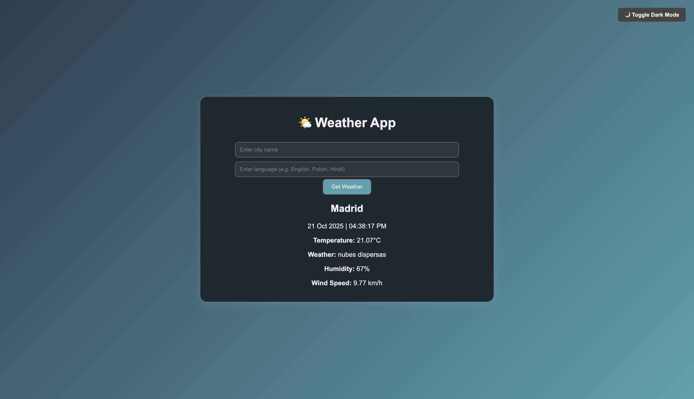

# 🌦️ Weather App (Flask + API + Multilingual)

A Flask-based weather web application that fetches **real-time weather data** using the **OpenWeatherMap API**.  
Users can enter any city name and view current weather details through a clean, responsive web interface with **Dark Mode support**.

---

## 📌 Features

- 🌍 **City-based Weather Search** – Enter any city to get real-time weather info  
- 🌐 **Multilingual Support** – Displays results in multiple languages  
- ⚡ **API Integration** – Uses a weather API to fetch live data 
- 🌙 **Dark Mode Toggle** – Switch between light and dark themes for better accessibility 
- 🧠 **Error Handling** – Handles invalid inputs
- 💻 **Interactive Web UI** – Built using **HTML**, **CSS**, and **Flask** 

---

## 🛠️ Tech Stack

- **Python 3.13.2**
- **Requests** (for API calls)
- **JSON** (for parsing API responses)
- **Flask** – Web framework for backend and routing   
- **JSON** – For parsing API responses  
- **HTML, CSS & JavaScript** – For front-end design and dark mode toggle  
- **Jinja2** – Flask’s template engine for inserting dynamic data into HTML
- **Translation library** 

---

## 🚀 How to Run

### 1. Clone the repository:
	git clone https://github.com/Shreyan6514/Weather-App.git

### 2. Navigate into the project folder:
	cd Weather-App
### 3. Install required dependencies:
	pip install -r requirements.txt

### 4. Run the app:
	python weather.py

### 5. Open the browser:
	Visit http://127.0.0.1:5000/ to use the app.

## ⚙️ Configuration
•	The app uses a Weather API key (OpenWeatherMap).
•	By default, the app looks for an environment variable named api-key.
•	If you don’t want to use environment variables, open weather.py and replace os.getenv("api-key") with your own key directly.

### Example:
	user_api = "your_api_key_here"

You can get a free API key from [OpenWeatherMap](https://openweathermap.org/api)

## Example Usage

- Type a city name (e.g., Warsaw, Tokyo, New York)
- Instantly view weather details such as temperature, humidity, conditions, and wind speed
- Toggle Dark Mode 🌙 to switch themes dynamically

## Preview

